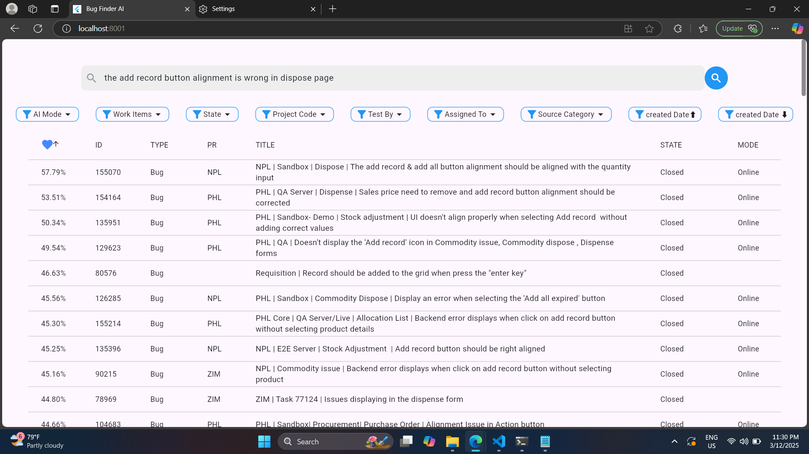
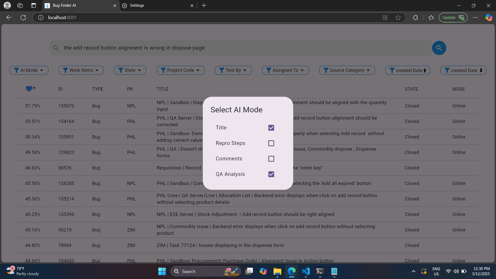
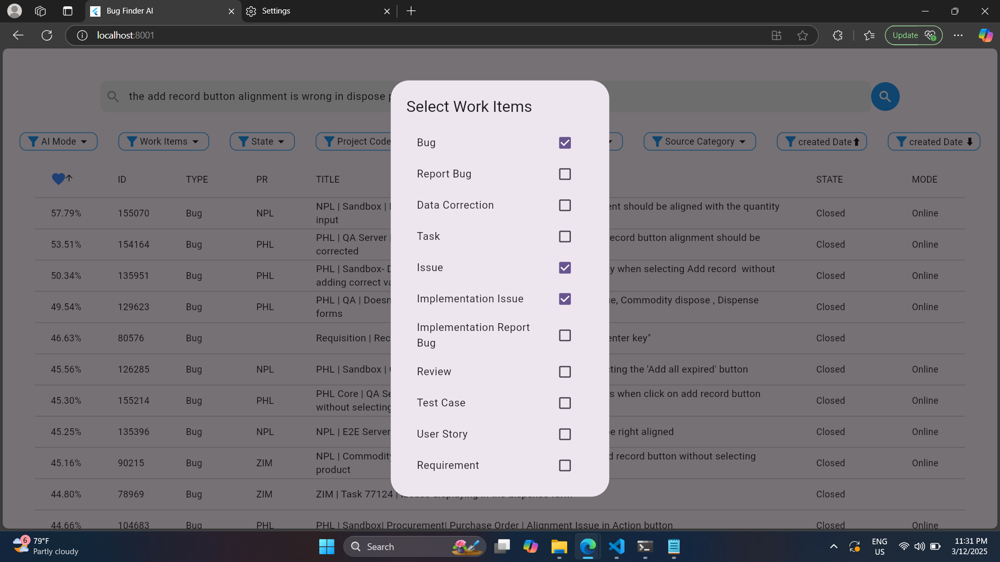
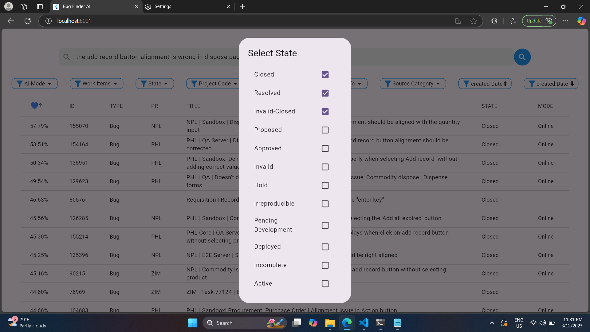

# BugFinder-UI

BugFinder-UI is the frontend implementation for the **BugFinder AI** system, an AI-driven bug tracking tool that enables software teams to find similar bug reports based on contextual meaning rather than exact keyword matching.

Created by Volta Jebaprashanth for use at Bileeta. Feel free to reach out at voltajeba@gmail.com or +94774637185.

This project serves as the UI for the backend system available at: [BugFinder AI Backend](https://github.com/VoltaJebaprashanth97/BugFinderAI).

---

## 🚀 Features
- **AI-Powered Similarity Search** – Retrieves relevant bug reports using NLP techniques.
- **FastAPI Integration** – Communicates with the BugFinder AI backend.
- **Advanced Filtering Options** – Search bugs by status, project, assigned user, and more.
- **Interactive Data Table** – Displays results with similarity scores and metadata.
- **State Management** – Uses `Provider` for efficient state handling.
- **Dio-Based API Calls** – Ensures robust and efficient HTTP communication.

---

## 📂 Project Structure
```
📂 BugFinder-UI/
│── 📂 lib/
│    │── 📂 filters/       # UI elements for filtering bug searches
│    │── 📂 table/         # Data table to display results
│    │── 📂 work_items/    # Data model for bug reports
│    │── main.dart          # Application entry point, API integration
│── 📜 pubspec.yaml        # Flutter dependencies
│── 📜 README.md           # Project documentation
```

---

## 🔧 Installation & Setup

### 1️⃣ Clone the Repository
```sh
git clone https://github.com/your-repo/BugFinder-UI.git
cd BugFinder-UI
```

### 2️⃣ Install Dependencies
```sh
flutter pub get
```

### 3️⃣ Run the Application
```sh
flutter run
```

**Note:** Ensure the **BugFinder AI backend** is running at `http://localhost:8000` before launching the UI.

---

## 📡 API Integration
BugFinder-UI interacts with the backend API using **Dio** for HTTP requests. The main API call is:
```dart
final response = await dio.post(
  "http://localhost:8000/process_data",
  data: requestBody,
);
```
- Sends **filter parameters** as JSON.
- Receives a list of similar bug reports.
- Displays results in the UI.
---
## 🤝 Sample Screenshots





## 🤝 Contributing
We welcome contributions from the community! To contribute:
1. Fork the repository.
2. Create a new branch (`feature-branch`).
3. Commit your changes (`git commit -m "Added new feature"`).
4. Push the branch (`git push origin feature-branch`).
5. Open a Pull Request.

---

## 🎯 Future Enhancements
- **Pagination & Lazy Loading** for large datasets.
- **Error Handling Improvements** in the UI.
- **Configurable API URLs** instead of hardcoded ones.

---

## ⭐ Support
If you find this project useful, please ⭐ star the repository!

